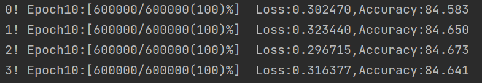

# 简单完全去中心化联邦学习

## 一、代码架构

1. configuration：存放配置文件
2. data：存放数据加载与处理代码
3. model：存放模型
4. train：存放训练代码
5. utils：存放工具函数

## 二、代码详解

### 1 数据集

选用 `FashionMNIST` 数据集，训练集涵盖60000张服饰图片，测试集涵盖10000张服饰图片，共有10种类别

### 2 参与训练客户端

1. 在代码中，创建4个不同的client对象，简单模拟4个客户端。

2. 客户端以**环形**方式连接，0->1->2->3->4
3. 客户端之间信息传输以函数调用形式体现，**但实际情况下，不同客户端之间数据传输应依靠网络IO，如何降低通信开销是后面需要注意的地方**

### 3 隐私求交

使用`Blind RSA`隐私求交技术对所有客户端共有数据进行求交，主要思想：

1. 由于客户端之间以环形方式连接，因此考虑使用`Blind RSA`进行**迭代求交**。
2. 设有n个客户端，所有客户端需要迭代n-1次。
3. 每次迭代，i号客户端都要与(i+1)%n（n-1号客户端与0号交换信息）号客户端进行`Blind RSA`式数据加密求交
4. 每次求交后，则保存交集数据的下表，用于下次迭代求交过程
5. 当n-1次迭代后，所有客户端都能拿到交集信息

### 4 模型训练

在获取到交集数据后，可以对模型进行训练，在训练过程中，设置超参数如下：

1. learning_rate ：0.15

2. epochs ：10

3. gamma ：0
4. batch_size ：128

### 5 梯度共享

在每个batch反向传播后，进行如下操作：

1. 阻塞等待相邻节点的 iteration 与当前节点的 iteration 相同，保证所有客户端训练同步
2. 向邻居节点发送梯度信息
3. 阻塞接受相邻节点发送的梯度信息
4. 当接收到所有邻居发送来的梯度信息后，对梯度进行更新
5. 梯度下降

**注：在目前代码中所有操作都保证同步，不过同步会造成资源的浪费，因此后期也可以考虑异步的可行性**

### 训练结束

训练 epochs 后，每个客户端都拿到了自身训练后的模型参数，训练结果如下：

