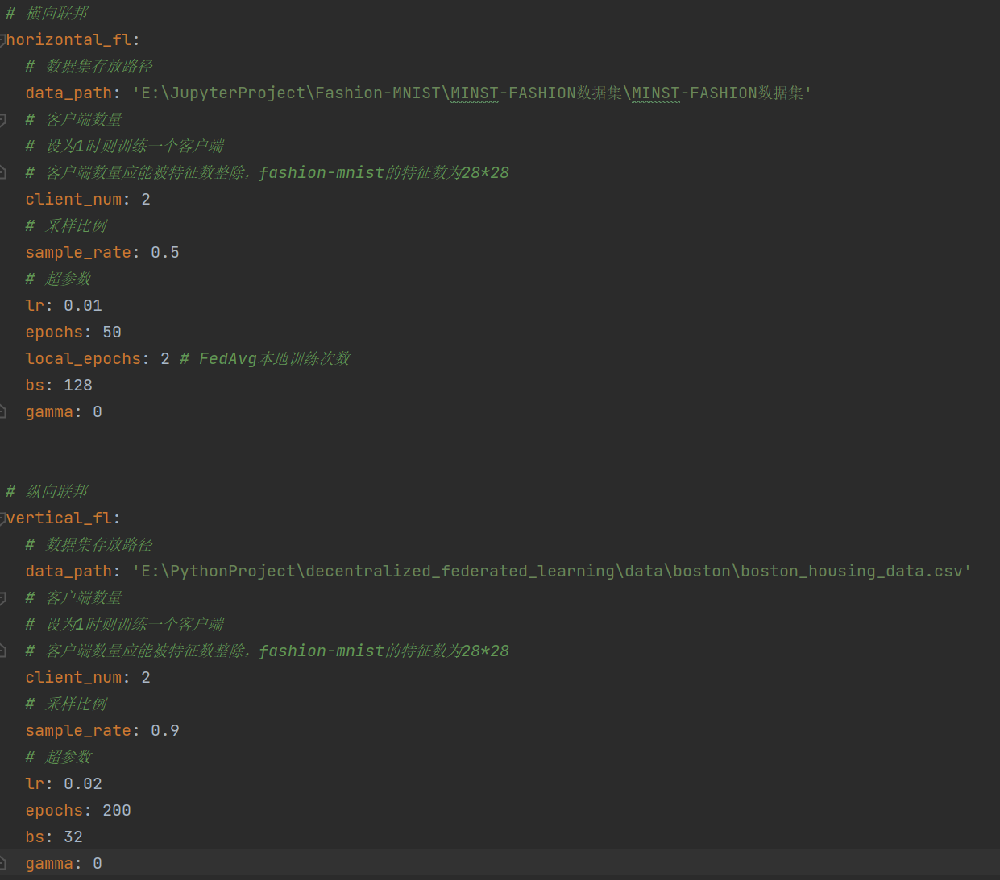
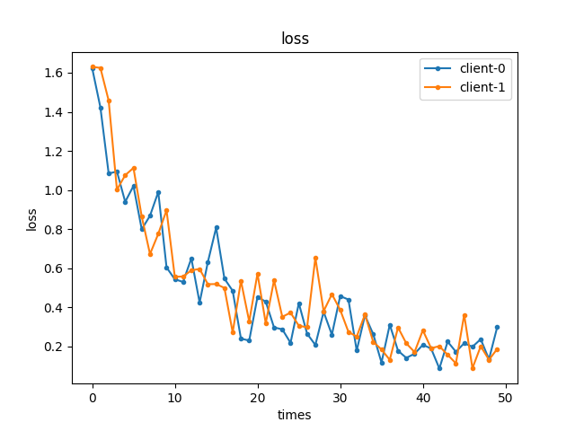
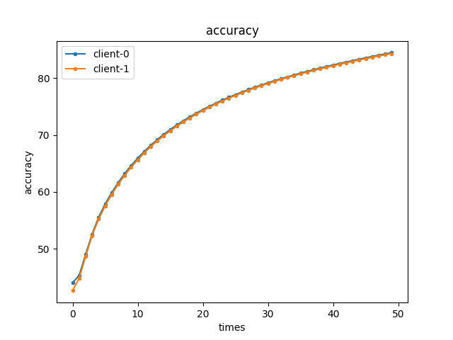

# 简单完全去中心化联邦学习

## 一、代码架构
1. configuration：存放配置文件，在配置文件中分为**横向联邦**与**纵向联邦**配置，可分开配置与运行

2. data：存放数据加载与处理代码
3. model：存放模型
4. train：存放训练代码
5. train/res：存放训练结果图，所有模型训练后的结果图会存放在该目录下
6. utils：存放工具函数
7. img：存放readme图片

## 二、代码详解
### (一) 横向联邦
#### 1 数据集

选用 `FashionMNIST` 数据集，训练集涵盖60000张服饰图片，测试集涵盖10000张服饰图片，共有10种类别

#### 2 参与训练客户端

1. 在代码中，创建n个不同的client对象，简单模拟n个客户端(客户端数量可在配置文件中配置)
2. 客户端以**环形**方式连接，[0->1->2->3->...->n->0]
3. 客户端之间信息传输以函数调用形式体现，**但实际情况下，不同客户端之间数据传输应依靠网络IO，如何降低通信开销是后面需要注意的地方**

#### 3.数据集获取与划分
1. 数据集获取：data/dataloader.py文件，根据路径获取数据集
2. 数据集划分：data/preprocess.py文件。对于横向联邦，为不同客户端client分配**特征相同但样本不同**的数据集

#### 4 模型训练
模型代码中为resnet18，可在代码中修改为resnet其他类型 `model/model/resnet.py`

在训练过程中，设置超参数如下(可在配置文件中配置)：
1. learning_rate：学习率
2. epochs：迭代次数
3. local_epochs：本地迭代次数(对应FedAvg中每个节点本地训练轮次)
3. gamma：SGD参数
4. batch_size：batch大小

#### 5 权重共享
**每个节点使用FedAvg方式聚合权重信息，作为下一次训练的权重**，在本地训练后(local_epochs结束后)，进行如下操作：
1. 阻塞等待相邻节点的 iteration 与当前节点的 iteration 相同，保证所有客户端训练同步
2. 向邻居节点发送权重信息
3. 阻塞接受相邻节点发送的权重信息
4. 当接收到所有邻居发送来的权重信息后，对当前梯度进行FedAvg操作，即求和取平均

**注：在目前代码中所有操作都保证同步，不过同步会造成资源的浪费，因此后期也可以考虑异步的可行性**

#### 6 训练结束
参数：
1. client_num: 2
2. sample_rate: 0.5
3. lr: 0.01
4. epochs: 50
5. local_epoch: 2
5. bs: 128
6. gamma: 0

训练 epochs 后，每个客户端都拿到了自身训练后的模型参数，训练结果如下：

### (二) 纵向联邦
#### 1 数据集

选用 `Boston` 数据集，原为sklearn中波士顿房价数据集，用于做回归分析。数据集位于`/data/boston/`目录下

#### 2 参与训练客户端

1. 在代码中，创建n个不同的client对象，简单模拟n个客户端(客户端数量可在配置文件中配置)
2. 客户端以**全连接**方式连接，是完全图
3. 客户端之间信息传输以函数调用形式体现，**但实际情况下，不同客户端之间数据传输应依靠网络IO，如何降低通信开销是后面需要注意的地方**

#### 3.数据集获取与划分
1. 数据集获取：data/dataloader.py文件，根据路径获取数据集
2. 数据集划分：data/preprocess.py文件。对于纵向联邦，为不同客户端client分配**特征不同且样本不同**的数据集(样本不同用于模拟样本对齐)

#### 4 隐私求交

使用`Blind RSA`隐私求交技术对所有客户端共有数据进行求交，主要思想：

1. 由于客户端之间以环形方式连接，因此考虑使用`Blind RSA`进行**迭代求交**。
2. 设有n个客户端，所有客户端需要迭代n-1次。
3. 每次迭代，i号客户端都要与(i+1)%n（n-1号客户端与0号交换信息）号客户端进行`Blind RSA`式数据加密求交
4. 每次求交后，则保存交集数据的下表，用于下次迭代求交过程
5. 当n-1次迭代后，所有客户端都能拿到交集信息

#### 5 模型训练
模型为自定义的线性回归模型 `model/model/regression.py`

在训练过程中，设置超参数如下(可在配置文件中配置)：
1. learning_rate：学习率
2. epochs：迭代次数
3. gamma：SGD参数
4. batch_size：batch大小

#### 6 sigma共享
在每个batch正向传播后，进行如下操作：
1. 阻塞等待相邻节点的 iteration 与当前节点的 iteration 相同，保证所有客户端训练同步
2. 向邻居节点发送sigma信息
3. 阻塞接受相邻节点发送的sigma信息
4. 当接收到所有邻居发送来的sigma信息后，对sigma进行更新(累加)
5. 根据新的sigma计算新损失 
6. 反向传播,梯度下降
**注：在目前代码中所有操作都保证同步，不过同步会造成资源的浪费，因此后期也可以考虑异步的可行性**

#### 7 训练结束

参数：
1. sample_rate: 1
2. lr: 0.015
3. epochs: 500
4. bs: 32
5. gamma: 0

训练 epochs 后，每个客户端都拿到了自身训练后的模型参数，训练结果如下：
1. 单节点

2. 双节点

3. 三节点

